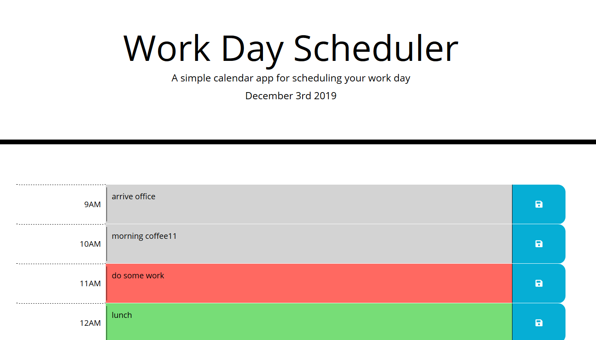

# Work Day Scheduler :alarm_clock:

This is a simple calendar application that allows the user to save events for each hour of the day. 
This app will run in the browser and feature dynamically updated HTML and CSS powered by jQuery.
The app displays standard business hours (9 a.m. to 5 p.m.). 

## Live Demo
https://tak-9.github.io/scheduler

## Usage
Enter your schedule in **Schedule** textbox. The **Save** icon becomes yellow. 

Click **Save** icon to save the input. 

The **Save** icon become white again. 

## Technologies
Following technologies are used for this application.

* HTML5 LocalStorage, CSS, [Bootstrap](https://getbootstrap.com/), JavaScript, [jQuery](https://jquery.com/), [Moment.js](https://momentjs.com/)

## Credit 
Icons made by <a href="https://www.flaticon.com/authors/prettycons" title="prettycons">prettycons</a> from <a href="https://www.flaticon.com/" title="Flaticon">www.flaticon.com</a>

Background image by [toptal](https://www.toptal.com/designers/subtlepatterns/page/3/)

